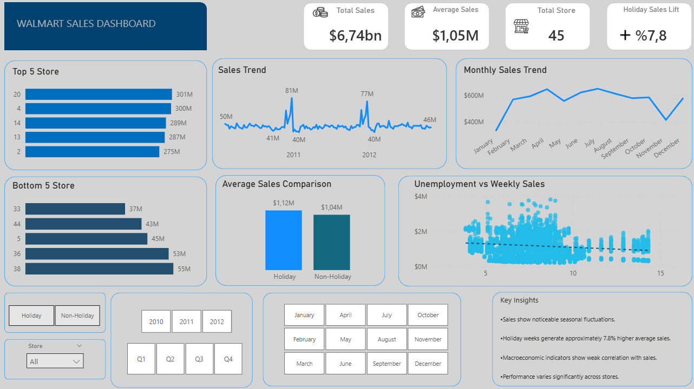
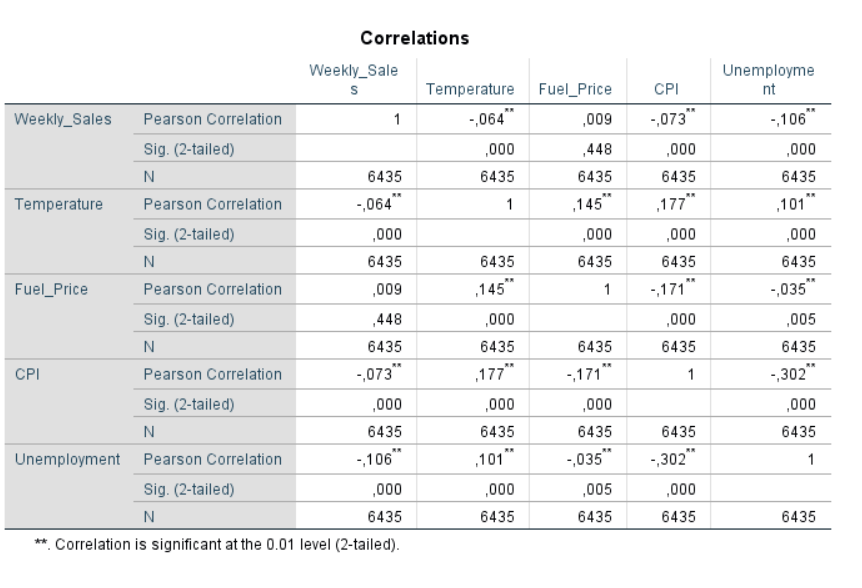

# Walmart Weekly Sales Analysis Dashboard

## Project Overview
This project analyzes Walmart's weekly sales performance across 45 stores between February 2010 and October 2012.

The objective is to identify:
- Sales trends
- Seasonal patterns
- Holiday effects
- Store-level performance differences
- Relationships between macroeconomic indicators and weekly sales

The analysis was conducted using Excel, Power BI, and SPSS.

---

# Business Objective

Retail companies need to understand the factors driving sales performance in order to optimize:
- Inventory planning
- Staffing decisions
- Promotional strategies

This project aims to answer the following business questions:
- How do sales evolve over time?
- Are there recurring seasonal patterns?
- Do holiday weeks generate higher sales?
- Which stores perform best and worst?
- Do macroeconomic variables affect weekly sales?

---

# Dataset Information

- *Dataset:* Walmart Weekly Sales Dataset
- *Period Covered:* February 2010 – October 2012
- *Number of Stores:* 45
- *Granularity:* Weekly

## Variables
- *Store* – Store identifier
- *Date* – Week ending date
- *Weekly_Sales* – Weekly sales revenue
- *Holiday_Flag* – Indicates whether the week includes a holiday
- *Temperature* – Regional air temperature
- *Fuel_Price* – Regional fuel price
- *CPI* – Consumer Price Index
- *Unemployment* – Regional unemployment rate

---

# Tools Used

- *Microsoft Excel* – Data cleaning and exploratory analysis
- *Power BI* – Interactive dashboard development
- *IBM SPSS Statistics* – Correlation significance testing

---

# Key Performance Indicators (KPIs)

| KPI | Description |
|---|---|
| Total Sales | Total revenue across all stores |
| Average Weekly Sales | Mean weekly sales |
| Total Stores | Number of unique stores |
| Holiday Sales Lift | Percentage increase during holiday weeks |
| Analysis Period | February 2010 – October 2012 |

---

# Analysis Performed

## Time Series Analysis
- Weekly sales trend
- Monthly sales trend
- Seasonal fluctuation analysis

## Holiday Impact Analysis
- Holiday vs non-holiday sales comparison
- Holiday sales uplift calculation

## Store Performance Analysis
- Top 5 stores by total sales
- Bottom 5 stores by total sales

## Correlation Analysis
- Weekly Sales vs CPI
- Weekly Sales vs Fuel Price
- Weekly Sales vs Unemployment
- Weekly Sales vs Temperature

---

# Statistical Validation (SPSS)

Pearson correlation significance tests were conducted in SPSS to evaluate the relationship between weekly sales and macroeconomic variables.

Although some correlations were statistically significant due to the large sample size, all coefficients remained very close to zero, indicating weak practical relationships with weekly sales.

---

# Correlation Results

| Variable | Correlation with Weekly Sales | Interpretation |
|---|---|---|
| Unemployment | -0.106 | Very weak negative relationship |
| CPI | -0.070 | Weak negative relationship |
| Temperature | -0.064 | Weak negative relationship |
| Fuel Price | 0.009 | No meaningful relationship |

---

# Key Insights

- Sales exhibit clear seasonal fluctuations.
- Holiday weeks generate approximately 7.8% higher sales.
- Macroeconomic variables show weak correlation with weekly sales.
- Store performance varies significantly across locations.

---

# Dashboard Features

- Interactive slicers for Store, Year, Quarter, Month, and Holiday Flag
- Weekly and monthly sales trends
- Holiday vs non-holiday comparison
- Correlation visualization
- Top and bottom performing stores
- Executive KPI cards

---

# Dashboard Preview

## Power BI Dashboard


---

# SPSS Correlation Analysis

## Pearson Correlation Output


---

# Business Recommendations

- Increase inventory and staffing during high-demand seasonal periods.
- Leverage holiday periods for targeted promotional campaigns.
- Investigate operational practices of top-performing stores.
- Focus on store-level and seasonal drivers rather than macroeconomic indicators.

---

# Future Improvements

- Build forecasting models using Python (ARIMA, Prophet, or XGBoost)
- Perform store clustering and segmentation
- Develop anomaly detection models for unusual sales spikes

---

# Project Structure

```bash
Walmart-Sales-Analysis/
│
├── data/
│   └── Walmart.csv
│
├── excel/
│   └── walmart_sales_analysis.xlsx
│
├── powerbi/
│   └── Walmart_Dashboard.pbix
│
├── spss/
│   └── correlation_output.spv
│
├── images/
│   ├── powerbi_dashboard.png
│   └──  walmart_correlation_spss.png
│   
│
└── README.md
